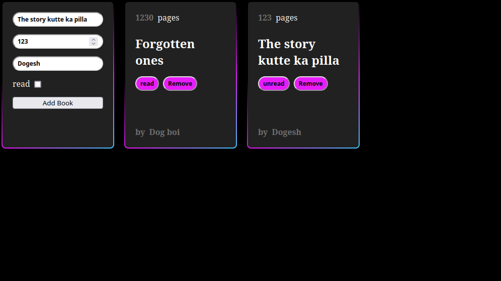

# Project_library📚

## Description 📃
An online library that allows users to log and manage their books. 

# Features 🌟

## Add and Remove Books ➕➖
Users can add books to their library by filling book details then pressing the "Add Book" button
The Remove button located on each card removes the card from the library.

## Toggle Reading Status ✅
Changing the book status to read/unread.

## Author
@tesserxt

